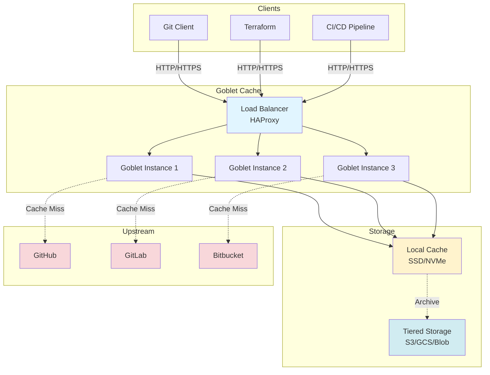

# Goblet: Git caching proxy

[](https://github.com/google/goblet/actions/workflows/ci.yml)
[](docs/index.md)

Goblet is a Git proxy server that caches repositories for read access. Git
clients can configure their repositories to use this as an HTTP proxy server,
and this proxy server serves git-fetch requests if it can be served from the
local cache.

In the Git protocol, the server creates a pack-file dynamically based on the
objects that the clients have. Because of this, caching Git protocol response
is hard as different client needs a different response. Goblet parses the
content of the HTTP POST requests and tells if the request can be served from
the local cache.

This is developed to reduce the automation traffic to googlesource.com. Goblet
would be useful if you need to run a Git read-only mirroring server to offload
the traffic.

This is not an official Google product (i.e. a 20% project).

## Architecture Overview



**Key Features:**
- 🚀 **5-20x faster** for cached operations
- 💾 **80% reduction** in network egress
- 🔄 **Automatic fallback** during upstream outages
- 🔒 **Multiple security patterns** for multi-tenant deployments
- 📊 **Full observability** with Prometheus metrics

## ⚠️ Security Notice

**IMPORTANT:** Multi-tenant deployments with private repositories require additional security configuration.

**Quick check:**
- ✅ **Safe:** Single user per instance, public repos only, or sidecar pattern
- 🚨 **At Risk:** Multiple users sharing instance with private repos

**See:** [SECURITY.md](SECURITY.md) for immediate actions | [Complete Security Guide](docs/security/README.md)

---

## 📚 Documentation

**Quick Links:**
- **[Getting Started](docs/getting-started.md)** - Setup and first deployment
- **[Security Guide](docs/security/README.md)** - Multi-tenant security
- **[Deployment Patterns](docs/operations/deployment-patterns.md)** - Architecture options
- **[Complete Documentation](docs/index.md)** - Full documentation index

---

## Usage

Goblet is intended to be used as a library. You would need to write some glue
code. This repository includes the glue code for googlesource.com. See
`goblet-server` and `google` directories.

## Offline Mode and Resilience

Goblet can serve ls-refs requests from the local cache when the upstream server is unavailable, providing resilience during upstream outages:

### Features

- **Automatic fallback**: When upstream is down or unreachable, Goblet automatically serves cached ref listings from the local git repository
- **Graceful degradation**: Git operations continue to work with cached data during upstream outages
- **Thread-safe configuration**: Uses atomic operations for concurrent read/write access to configuration
- **Staleness tracking**: Logs warnings when serving refs older than 5 minutes, helping identify stale cache scenarios
- **Testing support**: Upstream connectivity can be disabled entirely for integration testing
- **Zero configuration**: Works out of the box - automatic fallback requires no configuration changes

### How It Works

1. **Normal operation** (upstream available):
   - Goblet forwards ls-refs requests to upstream
   - Caches the response locally
   - Serves subsequent fetch requests from cache when possible

2. **Upstream failure** (network down, server unreachable):
   - Goblet detects upstream failure on ls-refs request
   - Automatically reads refs from local git repository cache
   - Logs fallback event for monitoring
   - Serves refs to client from cache

3. **Upstream recovery**:
   - Next ls-refs request attempts upstream again
   - On success, cache is updated with latest refs
   - System returns to normal operation

### Configuration

#### Production Mode (Default)

By default, Goblet operates with automatic fallback enabled. No configuration needed:

```go
config := &goblet.ServerConfig{
    LocalDiskCacheRoot: "/path/to/cache",
    URLCanonializer:    canonicalizer,
    TokenSource:        tokenSource,
    // UpstreamEnabled defaults to true with automatic fallback
}
```

#### Testing Mode (Disable Upstream)

For integration testing where you want to disable upstream connectivity entirely:

```go
falseValue := false
config := &goblet.ServerConfig{
    LocalDiskCacheRoot: "/path/to/cache",
    // ... other config ...
}
config.SetUpstreamEnabled(&falseValue)  // Thread-safe: disable all upstream calls
```

Or during server initialization:

```go
falseValue := false
ts := NewTestServer(&TestServerConfig{
    // ... other config ...
    UpstreamEnabled: &falseValue,  // Start with upstream disabled
})
```

### Monitoring

Goblet logs important offline mode events:

```
# Fallback to local cache
Upstream ls-refs failed (connection refused), attempting local fallback for /cache/path

# Stale cache warning (>5 minutes old)
Warning: serving stale ls-refs for /cache/path (last update: 10m ago)
```

Use these logs to:
- Track upstream availability issues
- Identify when cache is being served
- Monitor cache staleness
- Set up alerts for extended offline periods

## Testing

### Quick Start

Run the full test suite:

```bash
# Run all tests (short mode, ~38s)
task test-short

# Or with go directly
go test ./... -short
```

### Testing Offline Functionality

Test the offline mode features specifically:

```bash
# Run all offline-related tests
go test ./testing -v -run "Offline|Upstream|LsRefsLocal"

# Test with race detector (verifies thread safety)
go test -race ./testing -run "Offline"

# Test specific scenarios
go test ./testing -v -run TestOfflineModeWithWarmCache
go test ./testing -v -run TestUpstreamFailureFallback
go test ./testing -v -run TestConcurrentOfflineRequests
```

### CI Pipeline

Run the complete CI pipeline locally:

```bash
# Full CI (format, lint, test, build)
task ci

# Individual steps
task fmt-check    # Check code formatting
task lint         # Run linters
task test-short   # Run tests
task build        # Build binary
```

### Test Coverage

The offline mode implementation includes comprehensive test coverage:

- **4 integration tests**: End-to-end scenarios with real git operations
- **8 unit tests**: Edge cases, concurrency, filtering, symbolic refs
- **38 total tests**: All existing tests continue to pass

See [testing/TEST_COVERAGE.md](testing/TEST_COVERAGE.md) for detailed test documentation.

## Limitations

While Goblet can serve ls-refs from cache during upstream outages, fetch operations for objects not already in the cache will still fail if the upstream is unavailable. This is expected behavior as Goblet cannot serve content it doesn't have cached.

**Important**: The local cache must be populated before offline mode can serve requests. A cold cache (no prior fetches) will result in appropriate errors when upstream is unavailable.
